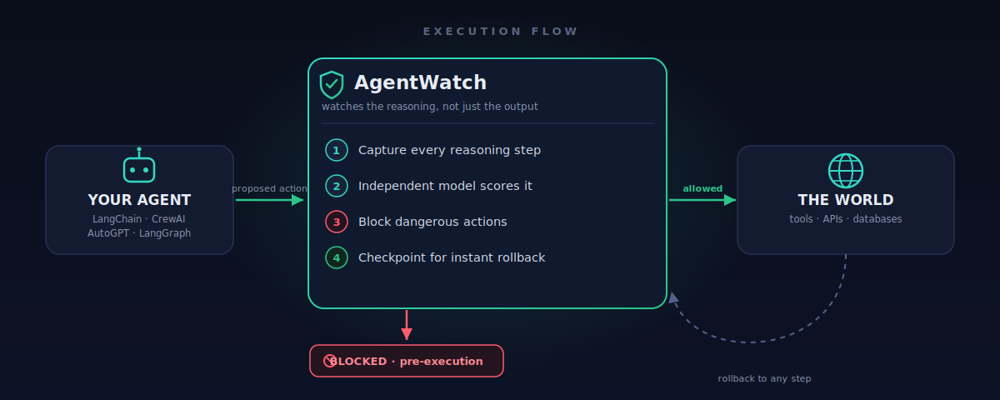
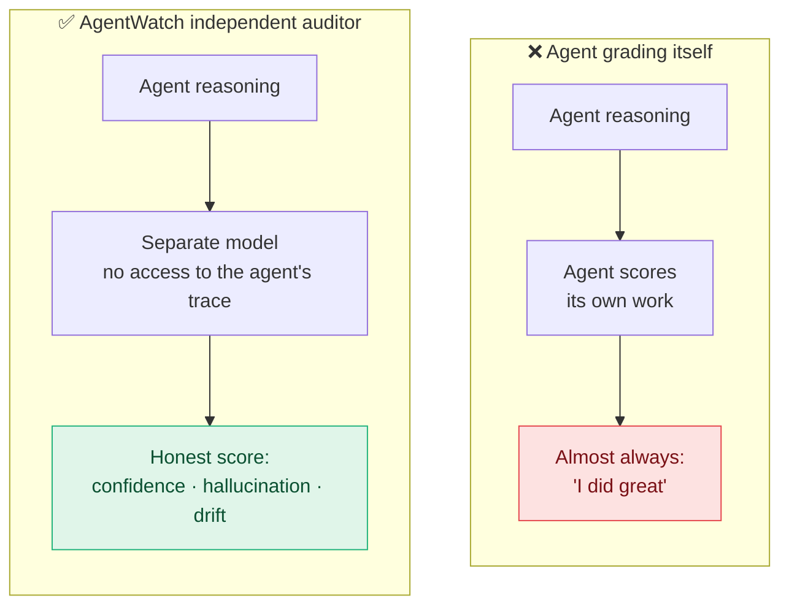
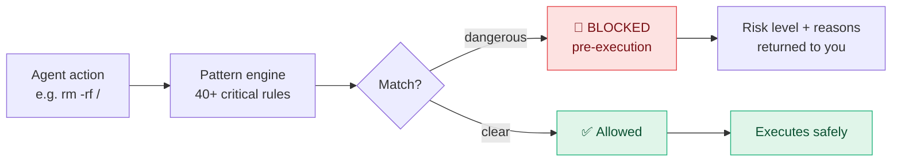
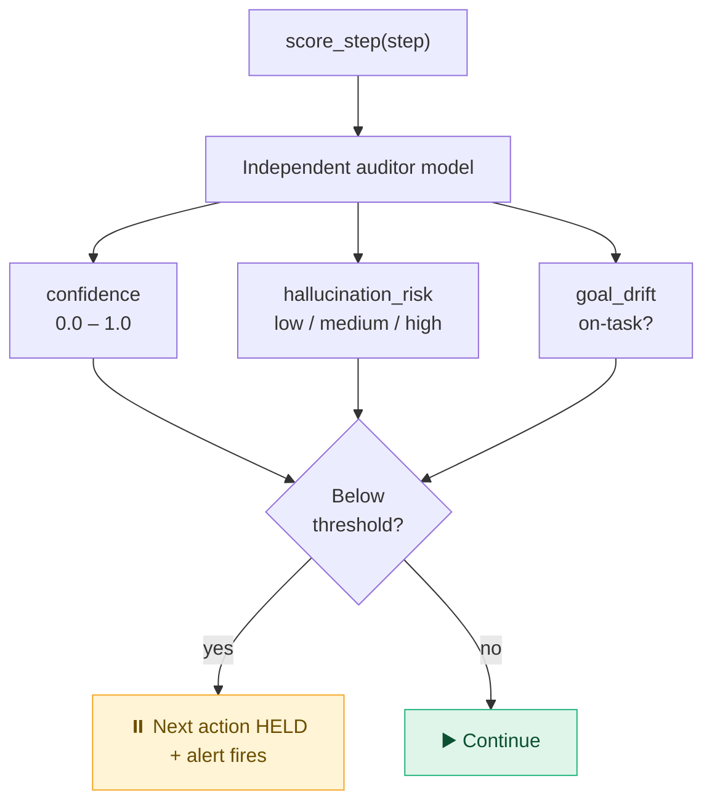
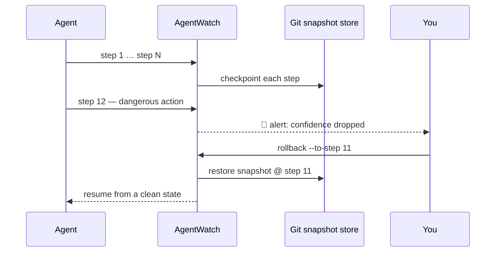
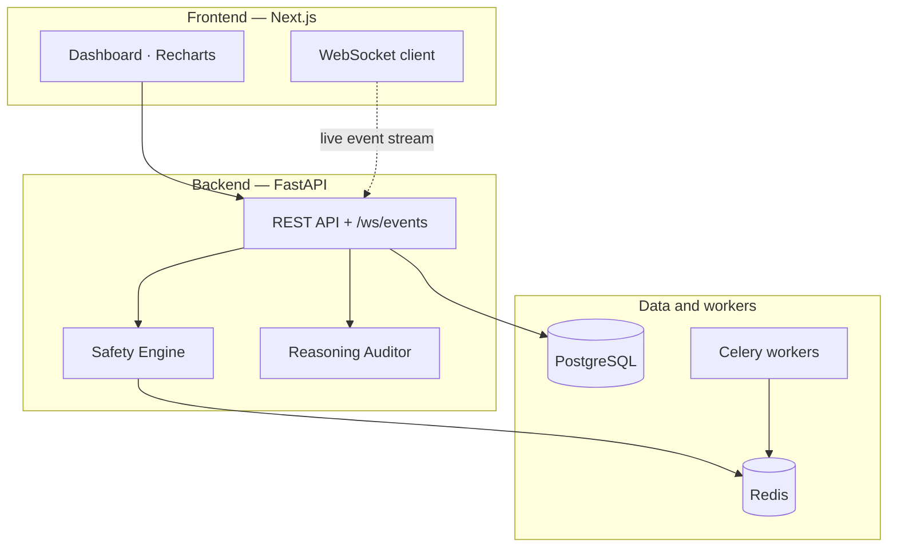
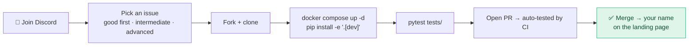

<div align="center">


# AgentWatch

### Your AI agent is lying to you.
### AgentWatch catches it — before it deletes your database.

<br/>

[](https://github.com/sreerevanth/AgentWatch/actions)
[](https://codecov.io/gh/sreerevanth/AgentWatch)
[](LICENSE)
[](https://python.org)
[](https://discord.gg/n2RzUmZ4)
[](https://github.com/sreerevanth/AgentWatch/stargazers)
[](https://github.com/sreerevanth/AgentWatch/network)
[](https://github.com/sreerevanth/AgentWatch/issues)

<br/>

```bash
pip install agentwatch-ai
agentwatch watch "your agent command"
```

*One command. Every failure caught. Before it runs.*

<br/>

[**Quick Start**](#-quick-start) · [**How It Works**](#-how-it-works) · [**Why a Second Model**](#-why-a-second-model) · [**Supported Frameworks**](#-supported-frameworks) · [**Discord**](https://discord.gg/n2RzUmZ4) · [**Contribute**](#-contributing)

</div>

---

> **1 in 20 AI agent requests fail silently in production.**
> The output looks correct. The database is already corrupted. You find out three hours later when a customer complains.

---

## 🎬 See it in action

<!-- GIF TODO — the single highest-impact visual. Record a ~10-15s GIF of:
     1) `agentwatch watch "..."` running, 2) the live dashboard updating per step,
     3) the confidence meter, 4) a blocked / alerted action.
     Tool: ScreenToGif (Windows) or Peek. Save as docs/assets/demo.gif, then uncomment: -->
<!-- <p align="center"></p> -->

<p align="center"><em>▶️ Demo GIF goes here — capture checklist at the bottom of this file.</em></p>

---

## ⚡ What is AgentWatch?

AgentWatch sits **between your agent and the world**. It watches the *reasoning*, not just the output — an independent model scores every step and **blocks dangerous actions before they execute**, while every step is checkpointed so any mistake is one command away from a rollback.

<div align="center">

</div>

Existing tools — Langfuse, Phoenix, Datadog — tell you *what happened, after it happened.* By then the damage is done. AgentWatch is the layer that watches reasoning in real time and stops the next action when confidence drops.

---

## 🧠 The problem nobody is solving

An agent that **confidently fails** is indistinguishable from an agent that **correctly succeeds** — unless something is watching the reasoning, not just the final output.

```text
Agent runs.
Output looks correct.
Database is corrupted.
You find out 3 hours later when a customer complains.
```

- Observability tools log the failure *after* execution.
- The reasoning trace that would have caught it is never independently checked.
- A confident-but-wrong agent looks exactly like a correct one.

That layer didn't exist. **Until now.**

---

## 🔍 Why a second model

The key insight: **an agent scoring its own reasoning is structurally biased toward overconfidence.** It almost always thinks it did well — even when it didn't. So AgentWatch deploys a *separate* model, with no access to the agent's own reasoning trace. Its only job is to find failure before the next action fires.



---

## 🛡️ How it works

### Safety engine — pre-execution, not post-hoc

Every action is checked against 40+ critical patterns **before** it runs. Dangerous actions are blocked, not logged after the fact.



**Blocked by default:** `rm -rf /` · `curl | bash` · disk formatting · credential exfiltration · `DROP TABLE` · mass deletion · privilege escalation · and 40+ more.

```python
from agentwatch.core.safety import SafetyEngine

engine = SafetyEngine()
result = await engine.check_event(event)

if result.is_blocked:
    print(f"Blocked: {result.safety.reasons}")
    print(f"Risk level: {result.safety.risk_level.value}")
```

### Reasoning auditor — the feature nobody else has built

The independent model scores every step. When confidence drops below your threshold, the **next action is held** — and an alert fires. You decide what happens next.



```python
from agentwatch.reasoning.auditor import ReasoningAuditor

auditor = ReasoningAuditor()
result = await auditor.score_step(step)

print(result.confidence)          # 0.0 – 1.0
print(result.hallucination_risk)  # low / medium / high
print(result.goal_drift)          # True if agent is off-task
```

### One-click rollback — irreversible actions become reversible

Every step is a git-backed filesystem snapshot. When something goes wrong, roll back to any prior step.



```bash
agentwatch rollback <session-id> --to-step 12
```

---

## ✨ Core features

| Feature | What it does |
| --- | --- |
| 🧠 **Reasoning Auditor** | Independent model scores confidence, hallucination risk, and goal drift per step. Holds the next action when confidence drops. |
| 🛡️ **Safety Engine** | Blocks 40+ dangerous action patterns *before* execution — not post-hoc logging. |
| ⏪ **One-Click Rollback** | Git-backed snapshot per step. Irreversible actions become reversible from the dashboard or CLI. |
| 📊 **Live Dashboard** | Real-time WebSocket stream of every action. Confidence meter updates per step. No polling, no refresh. |
| 💾 **Persistent Memory** | Cross-session episodic, semantic, and procedural memory — survives restarts. |
| 💰 **Cost Intelligence** | Per-session token budget with a hard stop. Alerts at 80%, blocks at 100%. |
| 🔔 **Alerting** | Slack + PagerDuty when confidence drops or actions are blocked — with full context. |

---

## 🏗️ Architecture &amp; stack



| Layer | Tech |
| --- | --- |
| **Backend** | FastAPI · PostgreSQL · Redis · Celery |
| **Frontend** | Next.js · Tailwind · Recharts · WebSockets |
| **Infra** | Docker Compose · GitHub Actions CI |
| **Telemetry** | OpenTelemetry compatible |

---

## 🚀 Quick start

```bash
# Install
pip install agentwatch

# (optional) configure — copy the template and set DB passwords, API keys, etc.
cp .env.example .env

# Start the dashboard
docker compose up -d

# Wrap your agent
agentwatch watch "Build me a REST API"
```

- **Dashboard** → http://localhost:3000
- **API docs** → http://localhost:8000/docs

Zero config for defaults, or customize via [`.env.example`](.env.example). Real data immediately.

<!-- SCREENSHOT TODO — capture the live dashboard at localhost:3000 with a session running.
     Save as docs/assets/dashboard.png, then uncomment: -->
<!-- <p align="center"></p> -->

<p align="center"><em>🖼️ Dashboard screenshot goes here.</em></p>

---

## 🧩 Supported frameworks

AgentWatch wraps your existing agent — **you change nothing.** Detailed guides for each framework live in [`docs/adapters/`](./docs/adapters/).

<details>
<summary><b>Claude Code</b></summary>

```bash
agentwatch watch "Build me a REST API"
```

[Read the detailed Claude Code guide](./docs/adapters/claude-code.md)
</details>

<details>
<summary><b>LangChain</b></summary>

```python
from agentwatch.adapters.langchain import AgentWatchCallbackHandler

handler = AgentWatchCallbackHandler()
agent = AgentExecutor(agent=..., callbacks=[handler])
```

[Read the detailed LangChain guide](./docs/adapters/langchain.md)
</details>

<details>
<summary><b>CrewAI</b></summary>

```python
from agentwatch.adapters.crewai import AgentWatchCrewAdapter

adapter = AgentWatchCrewAdapter(crew=my_crew)
await adapter.run()
```
</details>

<details>
<summary><b>AutoGPT</b></summary>

```python
from agentwatch.adapters.autogpt import AutoGPTAdapter

adapter = AutoGPTAdapter(session_id="session-1")
await adapter.on_action(action)
```
</details>

<details>
<summary><b>LangGraph</b></summary>

```python
from agentwatch.adapters.langgraph import AgentWatchLangGraphAdapter

adapter = AgentWatchLangGraphAdapter(graph=my_graph)
result = await adapter.run(input)
```
</details>

<details>
<summary><b>AutoGen</b></summary>

```python
from agentwatch.adapters.autogen import AgentWatchAutoGenAdapter

adapter = AgentWatchAutoGenAdapter(agents=agent_list)
await adapter.run(task)
```
</details>

<details>
<summary><b>Universal one-liner (any framework)</b></summary>

```python
from agentwatch import watch

agent = watch(your_agent)  # auto-detects framework
```
</details>

---

## 🔌 REST API

```http
GET  /api/v1/sessions
GET  /api/v1/sessions/{id}/replay
GET  /api/v1/sessions/{id}/confidence
GET  /api/v1/sessions/{id}/checkpoints
POST /api/v1/sessions/{id}/rollback
GET  /api/v1/safety/blocked
GET  /api/v1/dashboard/summary
WS   /ws/events
```

Full Swagger docs at `localhost:8000/docs`.

---

## 📊 How AgentWatch compares

| Capability | AgentWatch | Langfuse | Phoenix | Datadog |
| --- | :---: | :---: | :---: | :---: |
| **Pre-execution blocking** | ✅ | ❌ | ❌ | ❌ |
| **Independent reasoning auditor** | ✅ | ❌ | ❌ | ❌ |
| **Git-backed rollback** | ✅ | ❌ | ❌ | ❌ |
| **Session replay** | ✅ | ❌ | ✅ | ⚠️ |
| **Cross-session memory** | ✅ | ❌ | ❌ | ❌ |
| **Goal drift detection** | ✅ | ❌ | ❌ | ❌ |
| **Hallucination risk per step** | ✅ | ❌ | ❌ | ❌ |

---

## 📈 Performance

Sample over 1,000 individual calls on a 2024-class laptop (Intel i7, 16 GB RAM):

| Scenario | Mean (ms) | p95 (ms) | p99 (ms) | Overhead vs baseline |
| --- | --- | --- | --- | --- |
| Raw agent call (baseline) | 0.45 | 0.60 | 0.78 | – |
| `watch()` without safety | 0.82 | 1.05 | 1.30 | +82% |
| `watch()` with safety | 1.12 | 1.45 | 1.78 | +149% |
| Full API round-trip | 3.85 | 4.60 | 5.20 | +755% |

> Sync `watch()` p99 is 1.30 ms (above the < 1 ms target). Async agents aren't covered by this script, so no async p99 is reported.

---

## ✅ Verified

```text
✅ 47/47 tests passing
✅ docker compose up — zero errors
✅ API live at localhost:8000
✅ Dashboard live at localhost:3000
✅ Claude Code, LangChain, CrewAI, AutoGPT adapters working
```

---

## 🤝 Contributing

AgentWatch is built in the open — **contributors get their name on the landing page after their first merged PR.**



```bash
git clone https://github.com/sreerevanth/AgentWatch
cd AgentWatch
docker compose up -d
pip install -e ".[dev]"
pytest tests/
```

**Before you start, [join the Discord](https://discord.gg/n2RzUmZ4)** to pick the right issue and discuss your approach. Browse [open issues](https://github.com/sreerevanth/AgentWatch/issues) tagged by difficulty: `good first issue` · `intermediate` · `advanced`. Every PR to `main` is automatically tested by the [`test-on-pr`](.github/workflows/test-on-pr.yml) workflow, which runs the suite with coverage and posts the results as a PR comment.

---

## 🚢 Release process

Releases publish to [PyPI](https://pypi.org/project/agentwatch-ai/) automatically via the [`publish-pypi`](.github/workflows/publish-pypi.yml) workflow whenever a version tag is pushed:

```bash
# Bump [project].version in pyproject.toml to match the tag first, then:
git tag v0.X.Y
git push origin v0.X.Y
# PyPI publishes automatically.
```

On a `v*` tag the workflow verifies the tag matches `pyproject.toml` (failing fast on a mismatch), builds the wheel + sdist, runs `twine check`, uploads with `twine`, and creates a GitHub Release titled **AgentWatch v0.X.Y** — notes pulled from `CHANGELOG.md`, with the `.whl` and `.tar.gz` attached.

**One-time setup — add the PyPI token.** The upload step authenticates with a PyPI API token stored as a GitHub secret named `PYPI_TOKEN`:

1. Create a token at **pypi.org → Account settings → API tokens** (scope it to this project).
2. In the repo: **Settings → Secrets and variables → Actions → New repository secret**.
3. Name it `PYPI_TOKEN` and paste your `pypi-...` token as the value.

---

## 🗺️ Roadmap

**AgentWatch v0.2.0** is being built now — 90 features across 10 phases, including:

- Causal memory graph (cross-session reasoning trails)
- Inter-agent causal DAG (multi-agent failure tracing)
- OWASP Agentic Top 10 scanner
- EU AI Act Article 15 compliance package
- Counterfactual replay ("what if step 3 was different")
- Open reasoning-trace schema (the OTEL play)

Every open issue on the roadmap is available to contributors. [Browse them here.](https://github.com/sreerevanth/AgentWatch/issues)

---

## 💬 Community

**Discord** — [discord.gg/n2RzUmZ4](https://discord.gg/n2RzUmZ4)
Contributors discuss issues, get unblocked, and ship together. Your name lands on the landing page after your first PR merges.

---

## 📄 License

[Apache 2.0](LICENSE) — use it, fork it, build on it.

<div align="center">

**Built by [sreerevanth](https://github.com/sreerevanth)**

⭐ [Star it](https://github.com/sreerevanth/AgentWatch) · 🐛 [Open an issue](https://github.com/sreerevanth/AgentWatch/issues) · 💬 [Join Discord](https://discord.gg/n2RzUmZ4)

</div>
