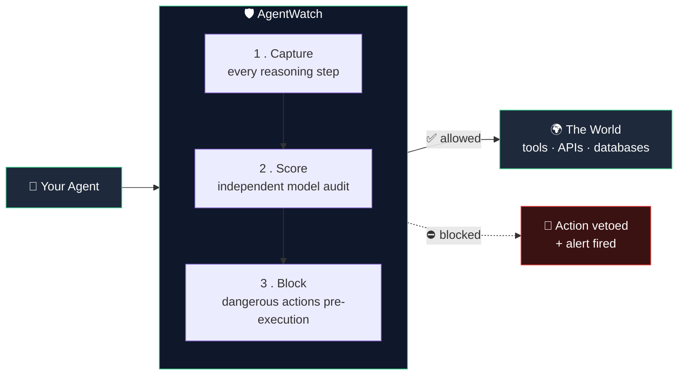
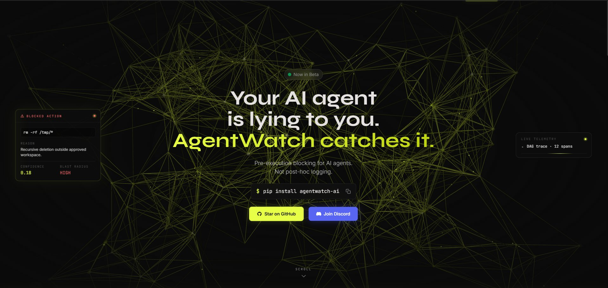
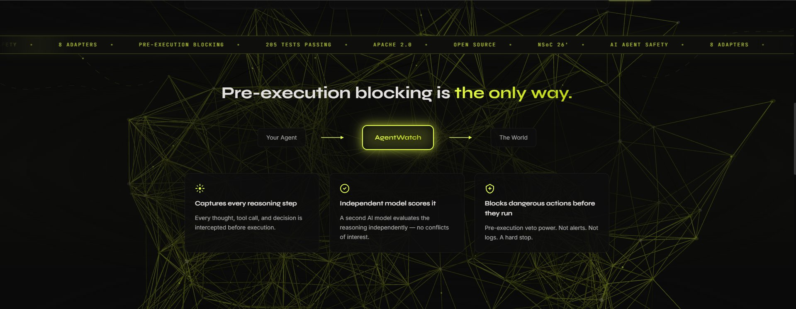
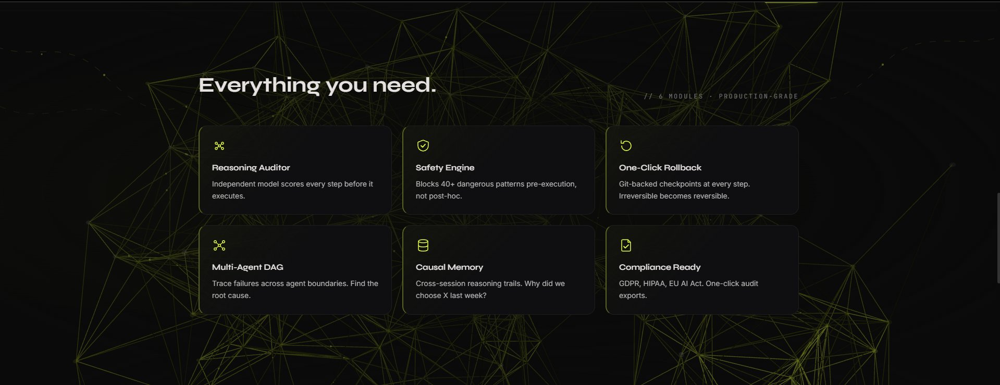
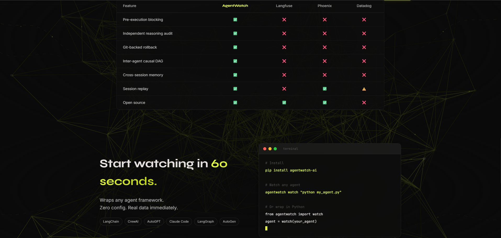
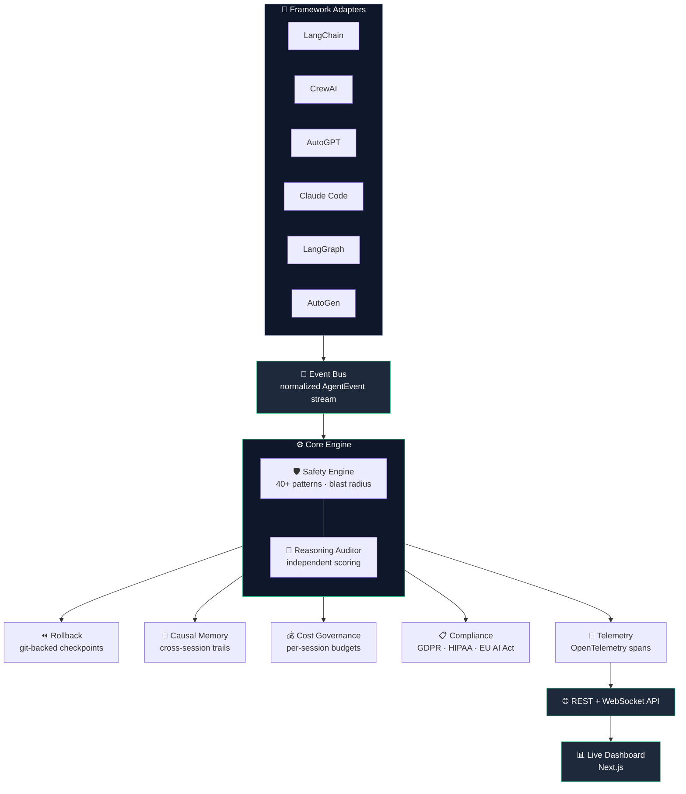
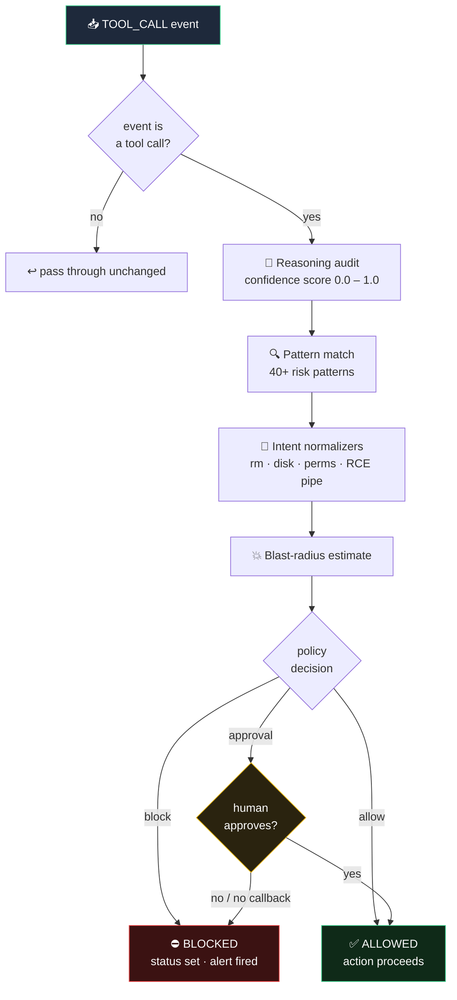
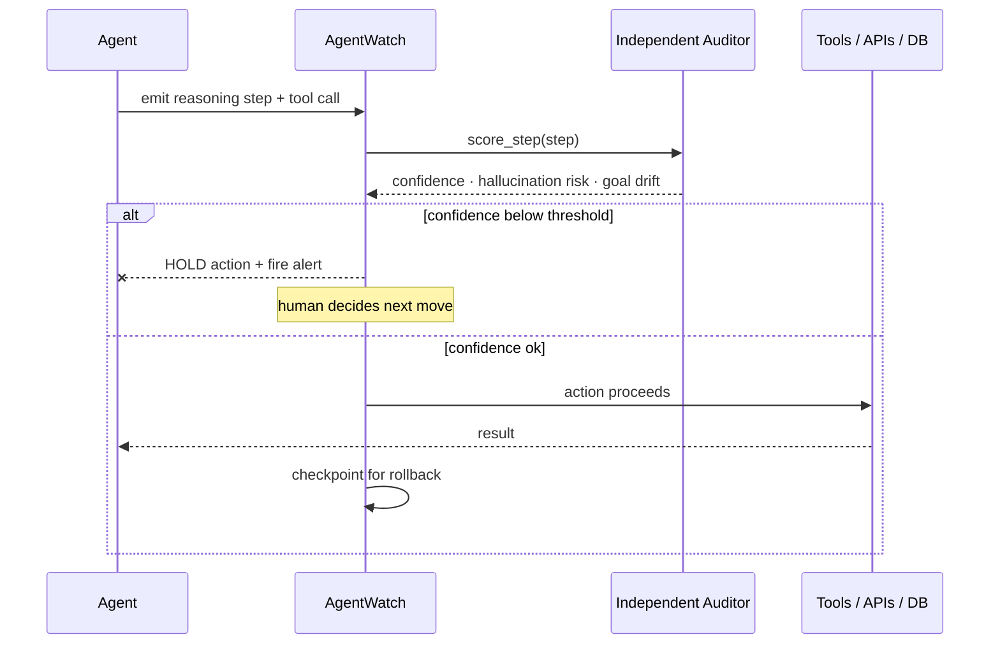
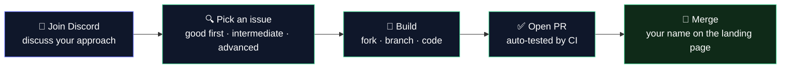

<div align="center">


# AgentWatch


**Your AI agent is lying to you.**
**AgentWatch catches it — before it deletes your database.**

<br/>

[](https://github.com/sreerevanth/AgentWatch)
[](https://codecov.io/gh/sreerevanth/AgentWatch)
[](LICENSE)
[](https://python.org)
[](https://discord.gg/n2RzUmZ4)
[](https://github.com/sreerevanth/AgentWatch/stargazers)
[](https://github.com/sreerevanth/AgentWatch/network)
[](https://github.com/sreerevanth/AgentWatch/issues)

<br/>

```
pip install agentwatch-ai
agentwatch watch "your agent command"
```

*One command. Every failure caught. Before it runs.*

<br/>

[**Quick Start**](#-quick-start) · [**How It Works**](#-how-it-works) · [**Architecture**](#-architecture) · [**Frameworks**](#-supported-frameworks) · [**Discord**](https://discord.gg/n2RzUmZ4) · [**Contribute**](#-contributing)

</div>

---

## The Problem Nobody Is Solving

```
Agent runs.
Output looks correct.
Database is corrupted.
You find out 3 hours later when a customer complains.
```

**1 in 20 AI agent requests fail silently in production.**

Current observability tools — Langfuse, Phoenix, Datadog — tell you *what happened* **after** it happened. By then the damage is done.

The real problem: **an agent that confidently fails is indistinguishable from an agent that correctly succeeds** — unless you have a layer watching the *reasoning*, not just the output.

That layer didn't exist. **Until now.**

| The cost of silent failure | |
|---|---|
| **1 in 20** | agent requests fail silently |
| **40%** | of enterprise AI projects cancelled by 2027 *(Gartner)* |
| **76%** | of agent deployments fail within 90 days |

---

## 💡 How It Works

AgentWatch sits **between your agent and the world**, intercepting every action *before* it executes.



**The key insight:** an agent scoring its own reasoning is structurally biased toward overconfidence. It almost always thinks it did well — even when it didn't.

AgentWatch deploys a **second model**, architecturally separate, with no access to the agent's own reasoning trace. Its only job: **find failure before the next action fires.**

---

## 📸 Screenshots

<div align="center">

<table>
  <tr>
    <td width="50%" align="center" valign="top">
      <br/>
      <sub><b>Pre-execution blocking, not post-hoc logging.</b><br/>A blocked <code>rm -rf /tmp/*</code> with live confidence (0.18) and blast-radius (HIGH) read out before it ever runs.</sub>
    </td>
    <td width="50%" align="center" valign="top">
      <br/>
      <sub><b>Your Agent → AgentWatch → The World.</b><br/>Capture every reasoning step, score it with an independent model, block dangerous actions before they run.</sub>
    </td>
  </tr>
  <tr>
    <td width="50%" align="center" valign="top">
      <br/>
      <sub><b>Six production-grade modules.</b><br/>Reasoning Auditor · Safety Engine · One-Click Rollback · Multi-Agent DAG · Causal Memory · Compliance Ready.</sub>
    </td>
    <td width="50%" align="center" valign="top">
      <br/>
      <sub><b>What nobody else ships.</b><br/>Pre-execution blocking, independent audit, git-backed rollback — and it wraps any agent framework in 60 seconds.</sub>
    </td>
  </tr>
</table>

</div>

---

## 🏗️ Architecture

AgentWatch is built as a layered system — adapters feed a normalized event stream into the core engine, which fans out to safety, reasoning, rollback, and observability subsystems.



---

## 🔐 Security Pipeline

Every `TOOL_CALL` event runs the full gauntlet before it is ever allowed to touch the outside world. Blocking happens **pre-execution** — not as a post-hoc log entry.



**Blocked by default:** `rm -rf /` · `curl | bash` · disk formatting · credential exfiltration · `DROP TABLE` · mass deletion · privilege escalation · **40+ additional critical patterns.**

The intent normalizers are what make this robust — they catch bypass attempts the naive regex misses: split flags (`rm -r -f /`), long-form flags (`rm --recursive --force /`), and reordered fetch-then-interpret RCE chains.

---

## 🔄 Reasoning Audit Sequence

The independent auditor scores each step *before* the action runs. A drop below threshold holds the next action and fires an alert — it is never logged after the fact.



---

## 🚀 Quick Start

```bash
# Install
pip install agentwatch-ai

# Configure environment variables (optional)
# Copy the template and edit it to set custom DB passwords, API keys, etc.
cp .env.example .env

# Start the dashboard
docker compose up -d

# Wrap your agent
agentwatch watch "Build me a REST API"
```

**Dashboard** → http://localhost:3000
**API Docs** → http://localhost:8000/docs

That's it. Zero config for default settings, or customize via the [.env.example](.env.example) file. Real data immediately.

---

## 🔌 Supported Frameworks

AgentWatch wraps your existing agent. **You change nothing.** Detailed guides for each framework live in the [`docs/adapters/`](docs/adapters/) directory.

| Framework | Adapter | Framework | Adapter |
|---|---|---|---|
| 🦜 **LangChain** | ✅ | 🔗 **LangGraph** | ✅ |
| 👥 **CrewAI** | ✅ | 🤖 **AutoGen** | ✅ |
| ⚡ **AutoGPT** | ✅ | 🧩 **smolagents** | ✅ |
| 🖥️ **Claude Code** | ✅ | 🌐 **Universal one-liner** | ✅ |

---

## ✨ Core Features

### 🧠 Reasoning Auditor
*The feature nobody else has built.*

```python
from agentwatch.reasoning.auditor import ReasoningAuditor

auditor = ReasoningAuditor()
audit = await auditor.audit_step(step.step_number, step)

print(audit.score)        # 0.0 – 1.0 confidence in the step
print(audit.rationale)    # why the auditor scored it this way
```

When the score drops below your threshold, the next action is **held — not logged after the fact.** An alert fires. You decide what happens next.

### 🛡️ Safety Engine

```python
from agentwatch.core.safety import SafetyEngine
from agentwatch.core.schema import ExecutionStatus

engine = SafetyEngine()
checked = await engine.check_event(event)

if checked.status == ExecutionStatus.BLOCKED:
    print(f"Blocked: {checked.safety.reasons}")
    print(f"Risk level: {checked.safety.risk_level.value}")
```

Blocks **40+ dangerous patterns pre-execution**, not post-hoc logging.

### ⏪ One-Click Rollback

```bash
agentwatch rollback <session-id> --to-step 12
```

Every step is a **git-backed filesystem snapshot.** Irreversible actions become reversible. Click rollback in the dashboard or use the CLI.

### 📊 Live Dashboard
Real-time WebSocket stream of every action your agent takes. Confidence meter updating per step. Colour-coded by span type. No polling. No refresh.

### 💾 Persistent Memory
Cross-session episodic, semantic, and procedural memory backed by a causal graph. Your agent remembers what it decided and *why* — across restarts, across sessions.

### 💰 Cost Intelligence
Per-session token budget with hard stop. Real-time spend tracking. Alerts at 80%. Blocks at 100%. Prevents runaway agents from bankrupting you overnight.

### 🔔 Alerting
Slack + PagerDuty when confidence drops or actions are blocked. Every alert contains full context — not just "something failed."

---

## 🌐 REST API

```
GET  /api/v1/sessions
GET  /api/v1/sessions/{id}/replay
GET  /api/v1/sessions/{id}/confidence
GET  /api/v1/sessions/{id}/checkpoints
POST /api/v1/sessions/{id}/rollback
GET  /api/v1/safety/blocked
GET  /api/v1/dashboard/summary
WS   /ws/events
```

Full Swagger docs at `localhost:8000/docs`.

---

## 🏆 What Nobody Else Has Built

| Feature | AgentWatch | Langfuse | Phoenix | Datadog |
|---|:---:|:---:|:---:|:---:|
| Pre-execution blocking | ✅ | ❌ | ❌ | ❌ |
| Independent reasoning auditor | ✅ | ❌ | ❌ | ❌ |
| Git-backed rollback | ✅ | ❌ | ❌ | ❌ |
| Inter-agent causal DAG | ✅ | ❌ | ❌ | ❌ |
| Cross-session memory | ✅ | ❌ | ❌ | ❌ |
| Session replay | ✅ | ❌ | ✅ | ⚠️ |
| Goal drift detection | ✅ | ❌ | ❌ | ❌ |
| Hallucination risk per step | ✅ | ❌ | ❌ | ❌ |

---

## 🧱 Stack

| Layer | Tech |
|---|---|
| **Backend** | FastAPI · PostgreSQL · Redis · Celery |
| **Frontend** | Next.js · Tailwind · Recharts · WebSockets |
| **Infra** | Docker Compose · GitHub Actions CI |
| **Telemetry** | OpenTelemetry compatible |

---

## ✅ Verified

- **205/205 tests passing**
- `docker compose up` — zero errors
- API live at `localhost:8000`
- Dashboard live at `localhost:3000`
- Claude Code, LangChain, CrewAI, AutoGPT adapters working

---

## 🤝 Contributing

AgentWatch is built in the open. **Contributors get their name on the landing page after their first merged PR.**



**Before you start** → join the [Discord](https://discord.gg/n2RzUmZ4). Get help picking the right issue, discuss your approach, and ship faster.

### Local Backend Setup

```bash
git clone https://github.com/sreerevanth/AgentWatch
cd AgentWatch
docker compose up -d
pip install -e ".[dev]"
pytest tests/
```

### Local Frontend Dashboard Setup

```bash
cd frontend
npm install
npm run dev
```

The dashboard will be live at `http://localhost:3000`.

Every PR to `main` is automatically tested by the **test-on-pr** workflow, which runs the suite with coverage and posts the results as a PR comment.

---

## 📦 Release Process

Releases publish to PyPI automatically via the **publish-pypi** workflow whenever a version tag is pushed:

```bash
# Bump [project].version in pyproject.toml to match the tag first, then:
git tag v0.X.Y
git push origin v0.X.Y
# PyPI publishes automatically.
```

On a `v*` tag the workflow verifies the tag matches `pyproject.toml` (failing fast on a mismatch), builds the wheel + sdist, runs `twine check`, uploads with `twine`, and creates a GitHub Release titled **AgentWatch v0.X.Y** — notes pulled from `CHANGELOG.md`, with the `.whl` and `.tar.gz` attached.

### One-time setup — add the PyPI token

The upload step authenticates with a PyPI API token stored as a GitHub secret named `PYPI_TOKEN`:

1. Create a token at pypi.org → Account settings → API tokens (scope it to this project).
2. In the repo: Settings → Secrets and variables → Actions → New repository secret.
3. Name it `PYPI_TOKEN` and paste your `pypi-...` token as the value.

---

## 🗺️ Roadmap

AgentWatch **v0.2.0** is being built now — 90 features across 10 phases including:

- Causal memory graph (cross-session reasoning trails)
- Inter-agent causal DAG (multi-agent failure tracing)
- OWASP Agentic Top 10 scanner
- EU AI Act Article 15 compliance package
- Counterfactual replay ("what if step 3 was different")
- Open reasoning trace schema (the OTEL play)

Every open issue on the roadmap is available to contributors. [Browse them here.](https://github.com/sreerevanth/AgentWatch/issues)

---

## 💬 Community

**Discord** — [discord.gg/n2RzUmZ4](https://discord.gg/n2RzUmZ4)

Contributors discuss issues, get unblocked, and ship together. Your name on the landing page after your first PR merges.

---

## 📄 License

**Apache 2.0** — use it, fork it, build on it.

<div align="center">

Built by [sreerevanth](https://github.com/sreerevanth)

⭐ **Star it** · 🐛 [**Open an issue**](https://github.com/sreerevanth/AgentWatch/issues) · 💬 [**Join Discord**](https://discord.gg/n2RzUmZ4)

</div>
