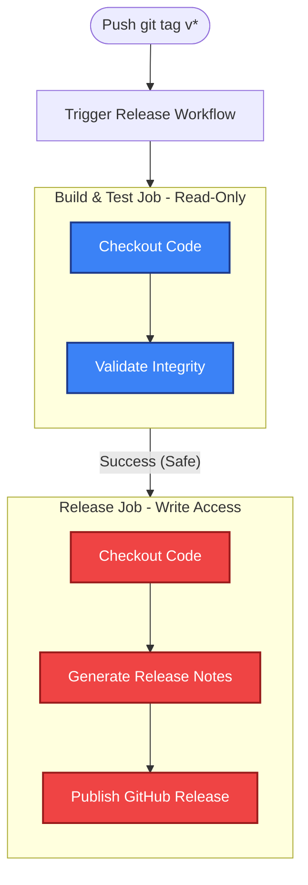

# Automated Release Workflow

This document outlines the GitHub Actions workflow designed for securely checking code and automatically creating GitHub releases for `AgentWatch`.

## 🏗️ Architecture & Flow

To adhere to the **Principle of Least Privilege**, our GitHub Actions workflow separates the read-only build and test processes from the write-enabled release process.



## 🔒 Security Best Practices

1. **Explicit Permission Scopes**: The global workflow permission is intentionally set to `{}` (none).
2. **Job Isolation**:
   - `build-and-test`: Explicitly granted `contents: read` to access the code.
   - `release`: Explicitly granted `contents: write` to allow the action to publish the generated GitHub Release.
3. **Commit SHAs**: Actions like checkout and release use immutable commit SHAs for maximum supply chain security.
4. **Concurrency Control**: Prevents multiple release workflows from running on the same tag simultaneously.

## 🚀 How to Create a Release

To trigger this workflow and publish a new release:

1. Commit your changes to `main`.
2. Create and push a new tag following semantic versioning (e.g., `v1.0.0`):

   ```bash
   git tag v1.0.0
   git push origin v1.0.0
   ```

3. The GitHub Action will automatically generate a changelog using `softprops/action-gh-release`.
