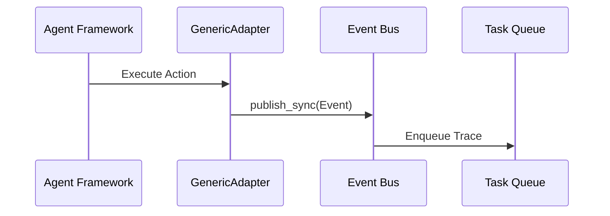

# Detailed Architecture Internals

## Event Bus Architecture
The event bus distributes asynchronous task tracing payloads to multiple targets. It runs on a thread-safe registry with reader-writer locks.

## Database Schema and Persistence
Database interactions map active telemetry via SQLAlchemy. Sessions are serialized as `AgentSession` models.
