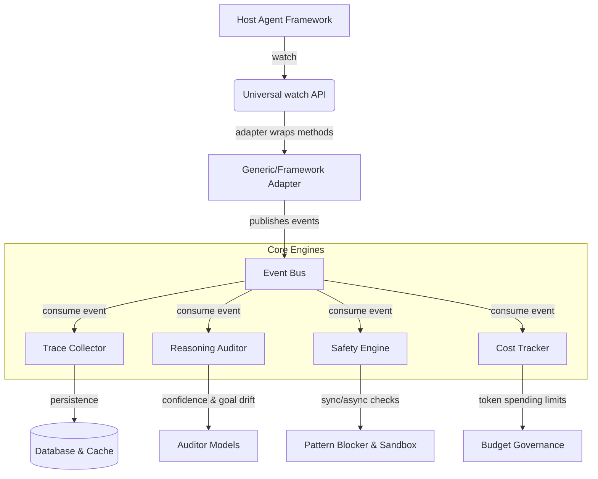

# AgentWatch System Architecture

This guide describes the internals of AgentWatch — the Reliability, Safety, and Observability layer for AI agents.

## Core Component Diagram

---

## 1. Instrumentation and Adapters
- **watch() API**: Universal entrypoint that attaches wrappers to objects from LangChain, LangGraph, CrewAI, AutoGPT, Smolagents, etc.
- **Adapters**: Framework-specific hook handlers that intercept method executions (like `invoke`, `run`, `kickoff`, `step`) and translate them to unified `AgentEvent` payloads.

## 2. The Event Bus
- Located in `agentwatch/core/event_bus.py`.
- Thread-safe publisher-subscriber engine that routes events to background tasks without interrupting or delaying the host agent's primary loop.

## 3. Safety Engine & Sandbox Simulation
- **Pattern Matcher**: Blocks destructive shell commands (`rm -rf /`, `DROP TABLE`) and data exfiltration vectors.
- **Sandbox**: Simulates tool execution bounds in a safe, ephemeral sandbox to evaluate blast radius before letting commands execute on the host machine.
- **Human-in-the-Loop**: Hooks into stdin/webhooks to pause execution and request human review for high/medium risk actions.

## 4. Reasoning Auditor
- Scores reasoning steps, checks goal alignment, and flags hallucination risk by evaluating stated facts against source context.
- Monitors semantic goal drift across long-lived sessions.

## 5. Cost and Budgets
- Tracks input/output token usage per session.
- Enforces strict monthly or daily spend limits, auto-downgrades models for simple tasks, and handles model failovers.

---

## Event Lifecycle Example

1. **Method Intercepted**: The adapter wraps a tool call.
2. **Pre-Execution Check**: The adapter queries the `SafetyEngine` synchronously/asynchronously.
3. **Verdict Evaluation**:
   - If **SAFE**, execution proceeds.
   - If **BLOCKED**, an `AgentWatchBlockedError` is raised, stopping the threat before damage occurs.
4. **Publishing**: An `AGENT_START` or `TOOL_CALL` event is pushed to the Event Bus.
5. **Consumption**: Trace Collector updates the active session; alerting engine posts to Slack/PagerDuty.

---

## Detailed Guides
- [Detailed Architecture Internals](architecture-detailed.md)
- [Developer Setup Manual](developer-setup.md)
- [Custom Adapters Tutorial](custom-adapters-tutorial.md)
- [Extended Getting Started Guide](getting-started-extended.md)
